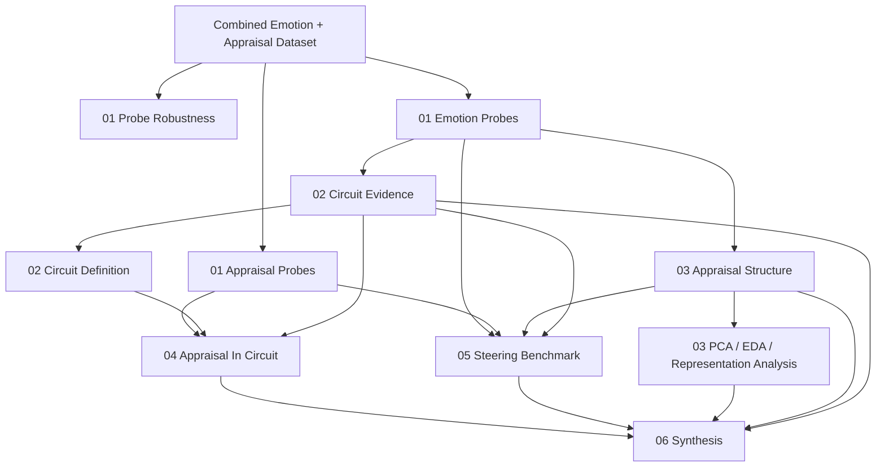
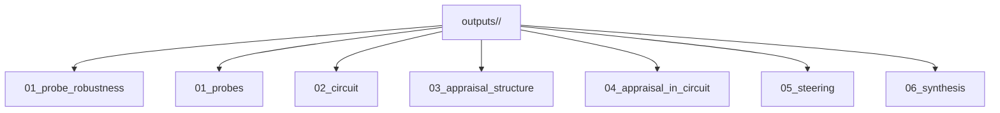

# Emotion Circuit And Appraisal Research Pipeline

## Documentation Note

The repository now has a cleaner multi-file documentation set under `docs/`:

- `docs/START_HERE.md`
- `docs/PIPELINE_TLDR_RESEARCH_PARTNER.md`
- `docs/RESEARCH_QUESTIONS.md`
- `docs/EXPERIMENTAL_SETUP.md`
- `docs/PIPELINE_MAP.md`
- `docs/OUTPUTS_GUIDE.md`
- `docs/GLOSSARY.md`
- `docs/RUNBOOK.md`
- `docs/BASELINE_PROBE_STEERING_STUDY.md` (optional baseline readouts + top-k appraisal steering)

This file remains as the long-form reference document. For current usage, prefer the `docs/` set above.

This document explains the repository as a **research system**, not just a codebase.

It is written to help a low-technical reader understand:
- what the project is trying to discover
- what each part of the pipeline does
- how the files connect to each other
- what outputs each stage creates
- what each output *means*
- how this could later become an interactive research dashboard

---

## 1. Plain-English Summary

This repository studies how large language models represent **emotion** internally.

More specifically, it asks:

1. Can the model's internal activations tell us which emotion a scenario expresses?
2. Can those same activations tell us about **appraisals** such as pleasantness, certainty, control, urgency, and responsibility?
3. Are there specific internal model locations that together form an **emotion circuit**?
4. Does **appraisal information live inside those emotion circuits**?
5. If we intervene on those internal emotion/appraisal directions, does the model's emotion perception change?

The larger theoretical idea is:

- emotion perception may be organized by **appraisal structure**
- appraisal information may be embedded inside the model's **emotion circuits**
- this is broadly consistent with **cognitive appraisal theory of emotion**

---

## 2. One-Sentence Mental Model

**Take a dataset of emotional scenarios -> split it carefully -> train emotion and appraisal probes -> identify important internal circuit sites -> analyze whether appraisal structure is present there -> intervene on those sites -> summarize the evidence**

---

## 3. Big Picture Pipeline

---

## 4. The Main Research Questions

### Question A
Can emotion be read out from hidden states?

Answered mainly by:
- `pipeline/train_probes.py`
- `pipeline/circuit_evidence.py`

### Question B
Can appraisal variables be read out from hidden states?

Answered mainly by:
- `pipeline/train_appraisal_probes.py`
- `pipeline/appraisal_structure.py`

### Question C
Are there particular internal sites that form an "emotion circuit"?

Answered mainly by:
- `pipeline/circuit_evidence.py`
- `pipeline/phase1_circuits.py`

### Question D
Does appraisal information live inside those emotion circuits?

Answered mainly by:
- `pipeline/phase2_compute.py`
- `pipeline/phase2_summary.py`

### Question E
If we add or erase appraisal-related information, does the model's emotion readout change?

Answered mainly by:
- `pipeline/steering_benchmark.py`
- `pipeline/phase2_compute.py`

### Question F
Are these patterns consistent with cognitive appraisal theory?

Answered by looking across:
- appraisal structure maps
- circuit geometry
- steering behavior
- appraisal ablations
- PCA / representation analysis

---

## 5. Core Repository Structure

```mermaid
flowchart TD
repo["Repository Root"] --> pipelineDir["pipeline/"]
repo --> experimentsUtils["experiments/utils/"]
repo --> rootUtils["utils.py"]
repo --> promptManager["prompt_manager.py"]
repo --> llmLegacy["LLMs/ (legacy wrappers)"]

pipelineDir --> pcore["core/ config model_config research_contracts"]
pipelineDir --> pshimlib["shims/ redirect.bind_shim"]
pipelineDir --> pdocs["docs/ PIPELINE README_PIPELINE RUN_FULL"]
pipelineDir --> pnotebooks["notebooks/"]
pipelineDir --> ps1["stage_01_probes/"]
pipelineDir --> ps2["stage_02_circuit/"]
pipelineDir --> ps3["stage_03_appraisal_structure/ + stage docs/"]
pipelineDir --> ps4["stage_04_appraisal_in_circuit/"]
pipelineDir --> ps5["stage_05_appraisal_theory/"]
pipelineDir --> ps6["stage_06_benchmarks/ + utils/"]
pipelineDir --> ps7["stage_07_orchestration/"]
pipelineDir --> ptests["tests/"]
pipelineDir --> pcli["*.py CLI shims + core aliases at package root"]

experimentsUtils --> trainUtils["training_utils.py"]
experimentsUtils --> dataUtils["data_utils.py"]
experimentsUtils --> interventionUtils["intervention_utils.py"]
```

Top-level `pipeline/*.py` names remain as **CLI shims** that delegate to `stage_*` implementation packages (see `pipeline/README.md`, `pipeline/STRUCTURE.md`, and `pipeline/docs/PIPELINE.md`).

---

## 6. Configuration Layer

### `pipeline/core/config.py` (import as `pipeline.config` via shim)

This is the **central settings file**.

It defines:
- where the dataset lives
- where outputs are written
- appraisal dimensions
- contrastive emotion pairs
- similar/comorbid emotion pairs
- split fractions
- supported-emotion thresholds
- probe hyperparameter grid

Important settings:
- `SELECTION_SPLIT`
- `FINAL_TEST_SPLIT`
- `MIN_SUPPORTED_EMOTION_TRAIN_COUNT`
- `MIN_SUPPORTED_EMOTION_SELECTION_COUNT`
- `PROBE_C_GRID`
- `CONTRASTIVE_EMOTION_PAIRS`
- `SIMILAR_EMOTION_PAIRS`

Why this matters:
- this file controls the **scientific defaults** of the pipeline

### `pipeline/model_config.py`
This is the **model execution settings file**.

It defines:
- layer counts per model
- extraction locations (`loc`)
- VRAM estimates
- default extraction batch sizes
- behavioral batch sizes
- default CPU probe parallelism

Important functions:
- `get_extraction_layers()`
- `get_extraction_locs()`
- `get_extraction_batch_size()`
- `get_behavioral_batch_size()`
- `get_default_probe_n_jobs()`
- `get_models_within_vram()`

Why this matters:
- this file controls the **practical runtime behavior**

---

## 7. Methodology / Experiment Rules

### `pipeline/research_contracts.py`
This file is the **methodological backbone** of the repo.

It defines:
- canonical dataset normalization
- scenario-level split logic
- supported-emotion benchmark logic
- cache manifest helpers
- pair taxonomy helpers
- hover-text formatting helpers
- raw-space conversion of probe directions

Most important functions:
- `canonicalize_combined_dataset()`
- `split_combined_dataset()`
- `supported_emotion_stats()`
- `make_split_manifest()`
- `emotion_probe_direction_raw()`
- `appraisal_probe_direction_raw()`
- `pair_category()`
- `wrap_hover_text()`

Why this matters:
- this file contains the **rules that keep the experiment honest**

---

## 8. Stage-By-Stage Explanation

## Stage 0: Probe Robustness

**Main file:** `pipeline/probe_training_robustness.py`  
**Main function:** `run_probe_training_robustness()`

### Purpose
This stage tests whether probe results are sensitive to how the text is presented during training.

### What it does
It builds multiple versions of the same dataset:
- `prompted_only`
- `prompted_plus_unprompted`
- `two_prompts_plus_unprompted`
- `three_prompts_plus_unprompted`

Then it:
- creates fair one-vs-all train/selection datasets
- logs per-emotion counts
- optionally runs a quick probe comparison at one selected site
- chooses the best variant for the main training stage

### Key helper functions
- `_build_data_variant()`
- `_run_processor_and_log()`
- `_run_quick_probe_comparison()`
- `_choose_best_variant()`

### Main outputs
Folder:
- `outputs/<model_id>/01_probe_robustness/`

Important files:
- `dataset_stats_train_per_emotion_per_variant.csv`
- `dataset_stats_val_per_emotion_per_variant.csv`
- `probe_robustness_comparison.csv`
- `probe_robustness_comparison.png`
- `best_variant_selection.json`
- `supported_emotions.json`
- `supported_emotion_counts.csv`

### What those outputs mean
- `dataset_stats_*`: how much data each emotion got in each variant
- `probe_robustness_comparison.csv`: which text variant works best on the selection split
- `best_variant_selection.json`: which representation the main probe stage should use
- `supported_emotions.json`: which emotions are safe enough to include in the main benchmark

### Research question answered
**Which text formulation gives the best and fairest probe training signal?**

---

## Stage 1A: Emotion Probes

**Main file:** `pipeline/train_probes.py`  
**Main function:** `run_train_probes()`

### Purpose
Train emotion probes across all selected internal model sites.

### What it does
For each supported emotion, it trains binary probes over the full selected grid of:
- layers
- locs
- token positions

It also:
- uses the selected best training variant from Stage 0
- tunes probe `C` on the selection split only
- reuses hidden-state extraction across repeated texts

### Main backend
**File:** `experiments/utils/training_utils.py`  
**Main class:** `OvaLogisticRegressionTrainer`

Most important methods:
- `load_model_and_tokenizer()`
- `extract_hidden_states()`
- `_train_binary_probe_simple()`
- `_train_layerwise_probes_single_emotion()`
- `train()`

### Main outputs
Folder:
- `outputs/<model_id>/01_probes/binary_ova_probes/`

Important files:
- `probe_summary.csv`
- `binary_ova_probes_<model>_...pt`
- `probe_manifest.json`

### What those outputs mean
- `probe_summary.csv`: how well each layer/loc site predicts each emotion
- `.pt` file: actual trained probe weights
- `probe_manifest.json`: what model and setup produced those probes

### Research question answered
**Where inside the model is emotion information linearly readable?**

---

## Stage 1B: Appraisal Probes

**Main file:** `pipeline/train_appraisal_probes.py`  
**Main function:** `run_train_appraisal_probes()`

### Purpose
Train appraisal regressors across model sites.

### What it does
Predicts appraisal dimensions from hidden states using train / selection logic.

### Important helper functions
- `_balance_by_emotion()`
- `_metric_row()`

### Main outputs
Folder:
- `outputs/<model_id>/01_probes/`

Important files:
- `appraisal_regression_probes.pt`
- `appraisal_probe_validation_detail.csv`
- `appraisal_regression_probes_manifest.json`

### What those outputs mean
- `appraisal_regression_probes.pt`: regression weights for appraisal dimensions
- validation CSV: how well each site predicts each appraisal
- manifest: provenance for those probes

### Research question answered
**Where inside the model are appraisal variables readable?**

---

## Stage 2: Circuit Evidence

**Main file:** `pipeline/circuit_evidence.py`  
**Main function:** `run_classification_experiment()`

### Purpose
Find the best-performing emotion circuit sites.

### What it does
It:
- extracts/caches hidden states for selection and test
- evaluates `single_best`
- evaluates `topk_fusion`
- evaluates `topk_fusion_global`
- automatically chooses `k` on the selection split
- reports final metrics on the held-out test split

### How top-k fusion becomes a final prediction
The aggregation rule is:
- `single_best`: use the full emotion score vector from one `(layer, loc)` site and predict the highest-scoring emotion.
- `topk_fusion`: for each emotion, take that emotion's score from each of its selected circuit sites, average those scores across sites, and then predict the emotion with the highest averaged score.
- `topk_fusion_global`: average the full emotion score vectors across one shared global top-k site list, then predict the highest-scoring emotion.

So the circuit is not using majority vote over site-level labels. It is averaging probe outputs first, then taking the final `argmax`.

### Important helper functions
- `_load_combined_eval_splits()`
- `_get_or_extract_split_hidden_states()`
- `_single_best_and_topk_pairs()`
- `_topk_pairs_per_emotion()`
- `_auto_select_k_pairs()`
- `_score_multiclass()`

### Main outputs
Folder:
- `outputs/<model_id>/02_circuit/`

Important files:
- `circuit_evidence_classification.csv`
- `circuit_evidence_classification.png`
- `circuit_top_k_selection.json`
- `selection_hidden_states.pt`
- `test_hidden_states.pt`

### What those outputs mean
- evidence CSV: how strong the circuit classifier is
- top-k selection JSON: which sites were selected and why
- hidden-state caches: saved activations for downstream stages

### Research question answered
**Does a multi-site circuit outperform a single best site?**

---

## Stage 2B: Circuit Packaging

**Main file:** `pipeline/phase1_circuits.py`  
**Main function:** `run_phase1()`

### Purpose
Translate site selection into circuit definition files.

### Outputs
- `circuits.json`
- `circuit_sites.json`

### What they mean
- `circuits.json`: simplified circuit summary
- `circuit_sites.json`: exact `(layer, loc)` sites per emotion

### Research question answered
**How do we define the circuit in a reusable way for later stages?**

---

## Stage 3: Appraisal Structure

**Main file:** `pipeline/appraisal_structure.py`  
**Main function:** `run_appraisal_structure()`

### Purpose
Describe how emotions are arranged in appraisal space.

### What it does
It produces:
- baseline classification metrics
- cluster summaries
- appraisal z-score heatmaps
- **appraisal label coupling** (via `pipeline/appraisal_label_coupling.py`): pairwise dimension overlap / independence on the train split, optional probe-score coupling on the test split (see `pipeline/stage_03_appraisal_structure/docs/APPRAISAL_LABEL_COUPLING.md`)

### Important helper functions
- `_load_probes_and_summary()`
- `_best_layer_loc()`
- `_probe_logits_at()`
- `_appraisal_zscore_by_emotion()`
- `run_appraisal_label_coupling()` (imported from `appraisal_label_coupling`)

### Main outputs
Folder:
- `outputs/<model_id>/03_appraisal_structure/`

Important files:
- `baseline_metrics.csv`
- `cluster_emotion_mapping.csv`
- `appraisal_zscore_by_emotion.csv`
- `appraisal_zscore_heatmap.png`
- `label_coupling/` (metrics CSVs, `figures/*.png` and `*.pdf`, `manifest.json`, `README.md`)
- `summary.md`

### Research question answered
**What does the model’s held-out emotional landscape look like in appraisal terms?**

---

## Stage 3B: Representation Analysis (PCA / EDA)

**Main file:** `pipeline/representation_analysis.py`  
**Main function:** `run_representation_analysis()`

### Purpose
Provide deep exploratory analysis of hidden-state geometry at every layer and loc.

### What it does
It creates:
- PCA decompositions per `(layer, loc)`
- explained variance summaries
- interactive HTML PCA plots with hover metadata
- static PCA figures with decision regions
- EDA summaries over label support, source distribution, and appraisal values

### Main outputs
Folder:
- `outputs/<model_id>/03_appraisal_structure/pca_eda/`

Important files:
- `pca_explained_variance.csv`
- `pca_site_summary.csv`
- `pca/layer_<L>_loc_<LOC>.html`
- `pca/layer_<L>_loc_<LOC>.png`
- `eda/emotion_counts_test.csv`
- `eda/source_emotion_counts_test.csv`
- `eda/appraisal_means_by_emotion_test.csv`

### Research question answered
**How is emotion/appraisal structure geometrically organized across layers and locations?**

---

## Stage 4: Appraisal In Circuit (Phase 2)

**Main files:**
- `pipeline/phase2_compute.py`
- `pipeline/phase2_summary.py`

**Main functions:**
- `run_phase2_compute()`
- `write_phase2_summary()`

### Purpose
Study what appraisal information looks like inside the selected emotion circuit.

### What it computes
- geometry between emotion and appraisal directions
- correlation with default-layer appraisal predictions
- cache-based appraisal ablations
- pair-category comparisons
- theory-facing summary figures

### Important functions in `phase2_compute.py`
- `compute_geometry_circuit_layers()`
- `compute_correlation_circuit_vs_default()`
- `compute_appraisal_ablation_effects()`
- `run_phase2_compute()`

### Main outputs
Folder:
- `outputs/<model_id>/04_appraisal_in_circuit/`

Important files:
- `geometry_circuit_layers.csv`
- `correlation_circuit_vs_default.csv`
- `appraisal_ablation_summary.csv`
- geometry figures
- ablation figures
- `SUMMARY.md`

### What those outputs mean
- geometry CSV: whether appraisal and emotion directions align at selected circuit sites
- correlation CSV: whether circuit-site appraisal predictions resemble default-layer appraisal predictions
- ablation CSV: whether removing appraisal information changes the circuit readout

### Research question answered
**Does appraisal information live inside emotion circuits, and does it matter for the circuit’s readout?**

---

## Stage 5: Steering Benchmark

**Main file:** `pipeline/steering_benchmark.py`  
**Main function:** `run_steering_benchmark()`

### Purpose
Compare appraisal steering and emotion steering.

### What it does
It tests:
- cache-based steering
- behavioral steering
- prompted vs unprompted comparisons
- behavioral appraisal ablations

### Important functions
- `_load_eval_split_both_text_types()`
- `_compute_appraisal_steering_vector()`
- `_circuit_logits()`
- `_run_behavioral_steering()`
- `run_steering_benchmark()`

### Theory-analysis helper file
**File:** `pipeline/theory_analysis.py`

Important functions:
- `add_pair_annotations()`
- `save_steering_pair_outputs()`
- `save_phase2_theory_outputs()`

### Main outputs
Folder:
- `outputs/<model_id>/05_steering/`

Important files:
- `steering_benchmark.csv`
- `steering_curves.csv`
- `steering_benchmark_behavioral.csv`
- `steering_curves_behavioral.csv`
- `steering_benchmark_by_pair.csv`
- `steering_benchmark_behavioral_by_pair.csv`
- `steering_benchmark_behavioral_by_text_type.csv`
- `behavioral_appraisal_ablation.csv`

### What those outputs mean
- benchmark CSVs: intervention performance by method
- by-pair CSVs: which emotion pairs are easy or hard to steer
- text-type CSVs: whether prompting changes behavioral intervention results
- behavioral ablation CSV: what happens when appraisal signature is erased in live forward passes

### Research question answered
**If we intervene on internal emotion/appraisal directions, does the model’s emotion perception change?**

---

## Stage 6: Synthesis

**Main file:** `pipeline/synthesis.py`  
**Main function:** `run_synthesis()`

### Purpose
Collect all stage outputs into a final model-level or multi-model summary.

### Important helper function
- `_collect_metrics_for_model()`

### Main outputs
Folders:
- `outputs/<model_id>/06_synthesis/`
- `outputs/synthesis/`

Important files:
- `synthesis_metrics.csv`
- `SUMMARY.md`
- copied key figures and tables from all prior stages

### Research question answered
**What is the final story across all evidence layers?**

---

## 9. Shared Utility Layer

## `experiments/utils/training_utils.py`
Main class:
- `OvaLogisticRegressionTrainer`

Purpose:
- load model/tokenizer
- extract hidden states
- train emotion probes
- tune hyperparameters
- reuse hidden-state extraction across repeated texts

## `experiments/utils/data_utils.py`
Main class:
- `BinaryOvaDatasetProcessor`

Purpose:
- construct one-vs-all train/selection datasets
- control class balance and negative sampling

## `experiments/utils/intervention_utils.py`
Important functions:
- `patch_hidden_states()`
- `steer_hidden_states()`
- `compute_steering_vector()`
- `erase_direction()`
- `mediation_hold_mediator_fixed()`

Purpose:
- provide the tensor-level intervention toolbox

## `utils.py`
Purpose:
- text dataset handling
- stock Hugging Face hook-based hidden-state extraction
- live forward-pass steering

Important functions:
- `extract_hidden_states()`
- `run_forward_with_steering()`
- intervention helpers for cached/hooked runs

---

## 10. Entry Points And Function Flow

### Main runner
**File:** `pipeline/run_pipeline_for_models.py`  
**Main function:** `run_pipeline_for_models()`

This is the main orchestration file.

It:
- selects models
- decides which stage runs next
- resumes incomplete runs
- aggregates synthesis at the end

### Pipeline stage order
Defined by `PIPELINE_STEPS` in `pipeline/stage_07_orchestration/runner.py` (invoked via `pipeline/run_pipeline_for_models.py`):

1. `probe_robustness`
2. `train_probes`
3. `train_appraisal_probes`
4. `circuit_evidence`
5. `phase1_circuits`
6. `appraisal_structure`
7. `phase2_summary`
8. `steering_benchmark`
9. `synthesis`

### Simplified execution graph

```mermaid
flowchart TD
runner["run_pipeline_for_models.run_pipeline_for_models()"] --> s0["probe_training_robustness.run_probe_training_robustness()"]
runner --> s1["train_probes.run_train_probes()"]
runner --> s2["train_appraisal_probes.run_train_appraisal_probes()"]
runner --> s3["circuit_evidence.run_classification_experiment()"]
runner --> s4["phase1_circuits.run_phase1()"]
runner --> s5["appraisal_structure.run_appraisal_structure()"]
runner --> s6["phase2_summary.write_phase2_summary()"]
runner --> s7["steering_benchmark.run_steering_benchmark()"]
runner --> s8["synthesis.run_synthesis()"]

s1 --> trainer["training_utils.OvaLogisticRegressionTrainer.train()"]
s2 --> extract["training_utils.OvaLogisticRegressionTrainer.extract_hidden_states()"]
s3 --> select["circuit_evidence._auto_select_k_pairs()"]
s5 --> pca["representation_analysis.run_representation_analysis()"]
s6 --> phase2["phase2_compute.run_phase2_compute()"]
s7 --> theory["theory_analysis.save_steering_pair_outputs()"]
```

---

## 11. Output Structure

Per model:

### `01_probe_robustness`
Meaning:
- dataset variants
- split stats
- best training text variant

### `01_probes`
Meaning:
- trained emotion and appraisal probes
- manifests and validation details

### `02_circuit`
Meaning:
- top-k circuit selection
- single-best vs top-k evidence
- selection/test hidden-state caches

### `03_appraisal_structure`
Meaning:
- descriptive appraisal landscape
- baseline test metrics
- PCA/EDA outputs
- **label coupling** (`label_coupling/`): pairwise appraisal overlap / independence diagnostics (see `pipeline/stage_03_appraisal_structure/docs/APPRAISAL_LABEL_COUPLING.md`)

### `04_appraisal_in_circuit`
Meaning:
- geometry diagnostics
- agreement diagnostics
- cache ablations
- theory summary

### `05_steering`
Meaning:
- intervention results
- pair-level steering
- behavioral robustness
- behavioral appraisal ablations

### `06_synthesis`
Meaning:
- final rollup of the story for each model or all models

---

## 12. What Each Output Means

### `probe_summary.csv`
How well each `(layer, loc)` site predicts each emotion

### `appraisal_probe_validation_detail.csv`
How well each site predicts each appraisal dimension

### `circuit_top_k_selection.json`
Which sites were selected and why `k` was chosen

### `circuits.json`
Simplified circuit definition for downstream use

### `appraisal_zscore_by_emotion.csv`
Average appraisal profile of each emotion

### `geometry_circuit_layers.csv`
Alignment of appraisal and emotion directions at selected sites

### `appraisal_ablation_summary.csv`
How much the circuit readout changes when appraisal information is removed

### `steering_benchmark.csv`
How much interventions shift the model’s emotion readout in the cache-based setting

### `steering_benchmark_behavioral.csv`
How much interventions affect live forward-pass behavior

### `pca_explained_variance.csv`
How much hidden-state variation each PCA component explains at each site

### `pca/layer_X_loc_Y.html`
Interactive view of hidden-state structure with hover metadata

### `synthesis/SUMMARY.md`
Final integrated story for the experiment

---

## 13. Supported Interface (CLI)

This repository is maintained as a **command-line** research pipeline. Run stages with `python -m pipeline.<module>` (see `docs/RUNBOOK.md` and `pipeline/run_pipeline_for_models.py`).

An experimental FastAPI layer and Streamlit GUI previously lived under `pipeline/app/` and `gui/`; they were removed to reduce maintenance surface. Any future HTTP or dashboard should live in a separate package with explicit dependencies.

For orientation, use:
- `docs/START_HERE.md`
- `docs/RUNBOOK.md`
- `README.md` (repo root)

---

## 14. What This Pipeline Proves — And What It Does Not

This repository builds a **ladder of evidence**:

1. **Readout evidence**
   - emotion probes
   - appraisal probes

2. **Circuit evidence**
   - multi-site readout vs single-site readout

3. **Representational evidence**
   - geometry
   - appraisal structure maps
   - PCA

4. **Intervention evidence**
   - cache-based appraisal ablations
   - behavioral steering and behavioral ablations

What it does **not** automatically prove:
- that the model “has emotions”
- that every internal association is causal in the human psychological sense
- that internal geometry alone is sufficient to establish theory

The strongest claims come from:
- held-out evaluation
- intervention results
- consistency across multiple stages

---

## 15. Recommended Next Documentation Step

That documentation split has now been completed in `docs/`.

Use:
- `docs/START_HERE.md` for orientation
- `docs/RESEARCH_QUESTIONS.md` for the scientific framing
- `docs/EXPERIMENTAL_SETUP.md` for methodology
- `docs/PIPELINE_MAP.md` for stage-level structure
- `docs/OUTPUTS_GUIDE.md` for interpretation of generated artifacts
- `docs/GLOSSARY.md` for concepts, metrics, and design choices
- `docs/RUNBOOK.md` for execution order and validation checkpoints

---

## 16. Quick Reference: Most Important Files

### Core control
- `pipeline/config.py`
- `pipeline/model_config.py`
- `pipeline/run_pipeline_for_models.py`
- `pipeline/research_contracts.py`

### Main stages
- `pipeline/probe_training_robustness.py`
- `pipeline/train_probes.py`
- `pipeline/train_appraisal_probes.py`
- `pipeline/circuit_evidence.py`
- `pipeline/phase1_circuits.py`
- `pipeline/appraisal_structure.py`
- `pipeline/representation_analysis.py`
- `pipeline/phase2_compute.py`
- `pipeline/phase2_summary.py`
- `pipeline/steering_benchmark.py`
- `pipeline/synthesis.py`

### Shared engines
- `experiments/utils/training_utils.py`
- `experiments/utils/data_utils.py`
- `experiments/utils/intervention_utils.py`
- `utils.py`

---
