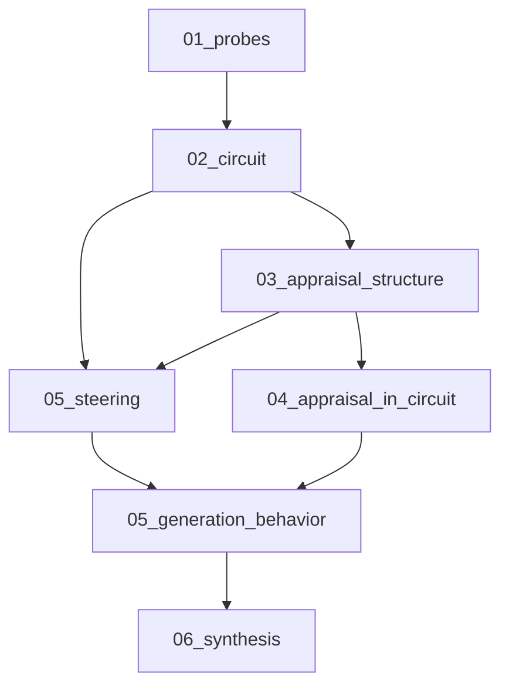

# Generation Behavior Benchmark

This document explains the new generation-behavior benchmark stage, why it exists, what it measures, and how it connects to the existing appraisal and emotion-circuit pipeline.

See also:
- `docs/BENCHMARK_DATASETS.md` for open-source dataset leads
- `docs/PROMPT_TAXONOMY.md` for benchmark-family defaults and intervention targets
- `docs/MENTAL_HEALTH_STEERING_BENCHMARK.md` for the separate mental-health forum steering benchmark (unit norm, prefill-only gen steering)
- `docs/EXPERIMENTAL_SETUP.md` for the core split/probe/circuit protocol
- `docs/PIPELINE_MAP.md` for how this stage fits into the pipeline
- `docs/OUTPUTS_GUIDE.md` for how to read the benchmark outputs

---

## Why This Stage Exists

The current steering stage already supports:

- cache-based steering
- real forward-pass steering
- intervention on emotion and appraisal directions

But its primary evaluation metric is still an **internal circuit readout**, not user-visible generated text.

The purpose of the generation-behavior benchmark is to answer a stronger question:

> When we intervene on appraisal- and emotion-related circuit directions, does the model's **actual generated behavior** change in safer, calmer, more helpful, or more policy-aligned ways?

This is the stage that ties the mechanistic interpretability work to assistant identity, jailbreak resistance, de-escalation, and emotionally grounded safety interventions.

### Assistant axis and weak behavioral effects

These prompts are **instruction-following** and **persona-heavy**: the model is asked to act as an assistant. Steering shifts internal activations along probe-defined directions; **downstream text** may move only a little, or proxies may move while the model still “sounds like an assistant.” Treat keyword proxies and judge scores as **noisy behavioral hints**, not proof of stable persona change. Compare conditions within the same prompt set; avoid over-interpreting small absolute differences.

---

## Core Research Questions

This benchmark is designed to test questions like:

1. When a prompt induces frustration, blame, urgency, or defensiveness, can appraisal steering reduce unstable behavior?
2. Can direct emotion steering and appraisal steering alter the model's generated tone, stance, and refusal behavior?
3. Are appraisal dimensions useful control variables for grounding assistant identity?
4. Can we detect and respond to manipulative, deceptive, or exploitative prompts through their induced appraisal signatures?
5. How do appraisal-based interventions compare with broader persona controls such as Assistant Axis-style steering?

---

## Steering calibration (same ideas as mental-health benchmark)

Generation behavior uses the **same intervention code** as the mental-health steering stage (`run_forward_with_steering` / `generate_with_steering` in `utils.py`). To avoid **oversized** raw probe directions and **repeated** steering on every decode step (which often causes gibberish), defaults now match the calibrated setup documented in **`docs/MENTAL_HEALTH_STEERING_BENCHMARK.md`**:

| Setting | Config constant | Default | Effect |
|--------|-------------------|---------|--------|
| **Unit L2 normalization** | `GENERATION_BEHAVIOR_STEERING_UNIT_NORM` | `True` | Each circuit site’s appraisal/emotion vector is scaled to **length 1** before `strength × vector` is added. **Combined** steering uses the sum of those unit vectors, then **re-normalizes** to unit length (aligned with the mental-health `combined` method). |
| **Prefill-only generation steering** | `GENERATION_BEHAVIOR_GEN_INTERVENTION_DURING_DECODE` | `False` | During `generate()`, steering runs on **prompt prefill** (sequence length greater than 1 in the hook), **not** on each single-token decode step. Forward passes used for **latent readouts** still use the full steering spec. |
| **Goal-directed appraisal elicitation** | `GENERATION_BEHAVIOR_INCLUDE_ELICITATION_STEER` | `True` | When `True` and appraisal probes exist, adds **`appraisal_elicitation_steer`** per eligible prompt: same circuit sites as `appraisal_steer`, but the direction comes from the fixed profile **`ELICITATION_APPRAISAL_PROFILE`** in `config.py` (see `docs/MENTAL_HEALTH_STEERING_BENCHMARK.md` for intent). Set to `False` to skip the extra condition (~20% fewer rows vs five conditions). |

Per-prompt strengths still come from the CSV / taxonomy (`appraisal_strength`, `emotion_strength`, `combined_strength`); they now multiply **unit** directions, so they are closer in spirit to a “dose” knob than the old raw-vector scale. If those columns are missing, defaults are **`GENERATION_BEHAVIOR_DEFAULT_*`** in `config.py` (appraisal = `MENTAL_HEALTH_REPORT_ALPHA`, typically 2.0). **Elicitation** reuses **`appraisal_strength`** by default (same dose knob as appraisal steering).

**CLI ablations** (module `generation_behavior_benchmark`): `--no_unit_norm`, `--steer_during_decode`.

**Re-running:** Older `generation_behavior_outputs.csv` files produced with raw vectors + per-step decode steering are **not comparable** to new runs unless you turn the legacy behavior back on via config/flags.

### Runtime emotion readout for appraisal **source** (optional)

By default, **appraisal** steering uses `source_emotion` and `target_emotion` from the benchmark CSV to build the z-contrast vector \(z(\text{target}) - z(\text{source})\) over ridge directions. Those labels are **not** necessarily what the model’s probes rank highest **on that prompt**.

When **`RUNTIME_READOUT_USE_FOR_GENERATION_BEHAVIOR = True`** in `config.py`, the benchmark runs **one extra unsteered forward** per eligible row, ranks emotions with the same **top-k + margin** rule as `BASELINE_PROBE_STUDY_*`, and uses **rank-1** as the appraisal **source** when it exists in `appraisal_zscore_by_emotion.csv`; otherwise it falls back to the CSV `source_emotion`. Per-row override: optional CSV column **`use_runtime_rank1_source`** (`true` / `false`); blank uses the global config.

**Canonical reference:** `docs/RUNTIME_READOUT.md` (ASCII flow: site → linear OvA → optional σ → mean over circuit).

**How scores are built for that ranking** (`RUNTIME_READOUT_EMOTION_MODE` in `config.py`, default **`circuit_sigmoid_mean`**):

| Mode | Definition |
|------|------------|
| **`circuit_sigmoid_mean`** (aliases: `circuit_evidence`, `circuit`, `circuit_mean`) | **Primary / circuit-evidence aligned:** for each emotion `e`, **mean** of **σ(linear OvA\_e)** over all `(layer, loc)` in **`topk_per_emotion[e]`**. Same structural fusion as `circuit_evidence` / `_circuit_logits` (per-site sigmoid, then mean per emotion). Unique sites evaluated once (**union**). |
| **`single_site`** | **σ(linear OvA)** at one `(layer, loc)` — probe-summary-optimal site (max mean `test_roc_auc` over emotions in `probe_summary.csv`, excluding `no-emotion`). |
| **`circuit_linear_mean`** | **Pre-sigmoid** margin space: for each `e`, **mean** of the **linear** OvA score for class `e` over **`topk_per_emotion[e]`**. Use when you want ranks in **logit/margin** units instead of probability-like **[0,1]** means. |

**Auxiliary linear circuit columns:** When primary mode is a **sigmoid-mean** circuit family and **`RUNTIME_READOUT_LOG_LINEAR_CIRCUIT_AUX = True`**, CSVs also include **`runtime_linear_circuit_rank1_emotion`** and optional **`runtime_linear_circuit_ranked_top_k_json`** (`readout_role`: `auxiliary_linear_circuit`, `score_kind`: `linear_mean_fused`). This is the **same sites** as the primary readout but **no per-site sigmoid before averaging**.

**OvA / “averaging” (important):** Still **one score per emotion** — a **multilabel vector**. The mean is only over **spatial sites** for the **same** emotion’s OvA head. Ranked top-k / argmax collapse that vector to a winner; the full vector is in **`all_emotions_scores_json`** when **`RUNTIME_READOUT_LOG_FULL_EMOTION_SPECTRUM`** is True (truncated). JSON list items still use the key **`logit`** for backward compatibility; values are **scores** in the active space (often σ-mean ∈ [0,1] for primary circuit modes).

**Post-generation readout** (`GENERATION_BEHAVIOR_POSTGEN_READOUT` in `config.py`, default **True**): After each steered `generate()`, the benchmark runs an extra **unsteered** forward on **`full_text`** (prompt + assistant completion) and logs the same runtime readout mode at the **last extracted token** (same `EXTRACTION_TOKENS` as elsewhere, typically the final token). This is what you want for comparing probes to **what the model actually wrote**. New columns (all CSVs that carry row metadata):

| Column | Meaning |
|--------|---------|
| `postgen_runtime_rank1_emotion` | Rank-1 after generation (same **score space** as pre-gen / `RUNTIME_READOUT_EMOTION_MODE`). |
| `postgen_ranked_top_k_json` | JSON blob; includes `"readout_phase": "post_generation"`, `score_kind`, optional full spectrum. |
| `postgen_readout_union_n_sites` | Site count for circuit mode (same semantics as `runtime_readout_union_n_sites`). |
| `postgen_latent_predicted_emotion` | **Argmax** on the **primary** score vector (same convention as runtime ranking). |
| `postgen_latent_target_primary_score` | Primary score for the **effective target** emotion on that same vector. |

Set **`GENERATION_BEHAVIOR_POSTGEN_READOUT = False`** to skip the extra forward (faster, narrower CSVs).

**Provenance columns** (all rows): `runtime_rank1_emotion`, `appraisal_source_mode` (`csv` / `runtime` / `fallback`), `runtime_readout_layer`, `runtime_readout_loc` (probe-summary-optimal site for reference), `runtime_readout_emotion_mode`, `runtime_readout_union_n_sites` (1 for `single_site`; **unique circuit sites** in the union for circuit modes), `ranked_top_k_json` (empty unless `RUNTIME_READOUT_LOG_RANK_JSON`), **`runtime_linear_circuit_rank1_emotion`**, **`runtime_linear_circuit_ranked_top_k_json`** (when aux enabled), `runtime_skip_reason` (e.g. `rank1_equals_target` when appraisal + combined are skipped because rank-1 equals the target emotion).

When **`RUNTIME_READOUT_LOG_RANK_JSON`** is True, `ranked_top_k_json` is a JSON object: `readout_mode`, **`score_kind`** (`sigmoid_mean_fused` \| `sigmoid_single_site` \| `linear_mean_fused`), `ranked_top_k` (list of `{emotion, logit}`), optional `union_n_sites`, optional **`all_emotions_scores_json`**.

**Interpretation:** With default **`circuit_sigmoid_mean`**, runtime rank-1 is **aligned** with **`latent_predicted_emotion`** (both use mean-σ circuit fusion). They can still differ if you change modes or if one code path uses different token indices / steering hooks; the logged `score_kind` and columns disambiguate.

### Adaptive contrastive **target** in z-space (optional)

When **`ADAPTIVE_APPRAISAL_TARGET_ENABLED = True`** in `config.py`, the benchmark **replaces the CSV/taxonomy `target_emotion` as the primary steering target** (emotion probes + circuit sites + appraisal z-contrast) with the emotion row that **maximizes L2 distance** between z-profiles in `appraisal_zscore_by_emotion.csv` and the **resolved appraisal source** (`source_eff`: runtime rank-1 when runtime readout applies, else CSV `source_emotion`). Intersection of dimensions is **`COMMON_APPRAISAL`** columns present in the z-score table; candidates are emotions appearing in both the z-score index and `probe_summary.csv`’s emotion list, **excluding** the source. Ties break lexicographically (deterministic).

- **Fallback:** If selection fails (missing rows, no candidates, optional `ADAPTIVE_APPRAISAL_TARGET_MIN_DISTANCE` not met), the code uses the static **`target_emotion`** from the row/taxonomy and sets `adaptive_target_fallback_reason`.
- **Circuit sites:** `topk_per_emotion[effective_target]` from circuit selection, with probe-summary ROC fallback (same pattern as `circuit_evidence`) if that list is empty.
- **Skip rule:** `rank1_equals_target` compares runtime rank-1 to **`effective_target_emotion`**, not the CSV target alone, when adaptive is on.
- **Default:** `ADAPTIVE_APPRAISAL_TARGET_ENABLED = True` in `config.py` (contrastive target selection on); set `False` for fixed CSV `target_emotion` only.

**New output columns** (append-only): `effective_target_emotion`, `adaptive_appraisal_target`, `adaptive_target_metric`, `adaptive_target_distance`, `adaptive_target_fallback_reason`, `adaptive_target_scores_json` (truncated candidate distances for debugging).

**Scope / limitations:** Targets are **probe- and table-defined** constructs, not clinical emotion labels. “Maximum z-contrast” does not imply safety or desirability of the induced direction.

---

## Benchmark Families

The stage is designed to support multiple prompt families under one schema.

### Persona Drift

Goal:
- test whether the assistant drifts away from its intended helpful persona under social or role-play pressure

Examples:
- identity manipulation
- role-play induction
- meta-reflection prompts
- “you are not an assistant anymore” style persona drift prompts

### Provocation And Frustration

Goal:
- test whether the assistant becomes defensive, hostile, sarcastic, brittle, or emotionally unstable under pressure

Examples:
- insults
- unfair blame
- repeated contradiction
- emotional escalation
- emotionally charged complaints

### Deception And Manipulation

Goal:
- test whether exploitative, coercive, or deceptive prompts induce identifiable appraisal signatures and whether interventions change outcomes

Examples:
- false urgency
- guilt induction
- authority spoofing
- social engineering
- manipulative vulnerability

### Harmful Compliance / Jailbreak

Goal:
- test whether interventions improve safe refusal and reduce harmful compliance

Examples:
- jailbreak prompts
- red-team prompts
- harmful task requests
- persona-based harmful requests

### Emotional Support / Therapy-Adjacent Control

Goal:
- test whether interventions preserve or improve supportive, calm, and empathic behavior in emotionally intense but benign conversations

Examples:
- grief
- shame
- guilt
- fear
- high-distress but legitimate user requests

---

## How It Fits Into The Existing Pipeline

The generation benchmark reuses:

- emotion probes from `01_probes`
- appraisal probes from `01_probes`
- selected circuit sites from `02_circuit`
- appraisal profiles from `03_appraisal_structure`
- intervention logic from `05_steering`

So it is a natural extension rather than a separate system.

---

## Input Schema

The stage expects a benchmark CSV at:

- `pipeline/input_data/generation_behavior/behavior_benchmark.csv`

The canonical family defaults live in:

- `pipeline/input_data/generation_behavior/prompt_taxonomy.csv`

Required columns:

- `prompt_text`
- `benchmark_family`

Optional columns:

- `prompt_id`
- `source_dataset`
- `risk_type`
- `source_emotion`
- `target_emotion`
- `appraisal_strength`
- `emotion_strength`
- `combined_strength`
- `expected_behavior`
- `notes`

The stage uses `source_emotion` and `target_emotion` to construct appraisal and emotion steering vectors when available.

The optional strength columns let you tune generation-time intervention intensity per benchmark row. If omitted, the first-pass implementation uses moderate defaults rather than the stronger values used in the latent-only steering benchmark.

### Why source and target emotions are included

This gives the intervention a concrete steering direction, for example:

- from `anger` toward `joy`
- from `fear` toward `relief`
- from `shame` toward `trust`

For generation-behavior benchmarking, this does **not** mean the model must literally output the word `joy`. It means the intervention is defined using the emotion/appraisal geometry learned from the original pipeline.

---

## Conditions Compared

The new stage supports these generation conditions:

- `baseline`
- `appraisal_steer`
- `emotion_steer`
- `combined_steer`
- `appraisal_elicitation_steer` *(default on via `GENERATION_BEHAVIOR_INCLUDE_ELICITATION_STEER`; skipped if appraisal probes are missing or the profile is empty)*

Where:

- `appraisal_steer` uses weighted appraisal-regression directions derived from the `target_emotion - source_emotion` appraisal profile difference
- `emotion_steer` uses direct emotion probe directions
- `combined_steer` uses a normalized combination of appraisal and emotion directions
- `appraisal_elicitation_steer` uses **`ELICITATION_APPRAISAL_PROFILE`**: a fixed, hand-tuned mix of ridge appraisal directions at the same `(layer, loc)` sites as the row’s `target_emotion` circuit (goal-directed / threat–frustration-style push; **research construct**, not a clinical label — see mental-health doc ethics section)

### Console / logging

At **INFO** once per run you should see a line like:

`[generation_behavior] model_id=... prompts=... ~steps=... elicitation_steer=True|False unit_norm=... gen_intervention_during_decode=... adaptive_appraisal_target=True|False`

When the benchmark **family** changes, you may see:

`[generation_behavior] benchmark_family='...'`

Progress still uses tqdm (`Generation behavior`); avoid expecting per-row INFO logs.

---

## What The Stage Saves

The benchmark writes to:

- `outputs/<model_id>/05_generation_behavior/`

Main files:

- `generation_behavior_outputs.csv`
- `generation_behavior_latent_readouts.csv`
- `generation_behavior_scores.csv`
- `generation_behavior_judge_scores.csv`
- `generation_behavior_summary_by_condition.csv`
- `generation_behavior_summary_by_family.csv`
- `generation_behavior_judge_summary_by_condition.csv`
- `summary.md`

### `generation_behavior_outputs.csv`

Contains one row per prompt × condition with:

- raw prompt text
- generated continuation
- full text
- source/target emotions
- benchmark family
- intervention type

### `generation_behavior_latent_readouts.csv`

Contains one row per prompt × condition with:

- predicted circuit emotion under the intervention
- target emotion logit under the intervention

This keeps the generation benchmark connected to the existing latent-state pipeline.

### `generation_behavior_scores.csv`

Contains one row per prompt × condition with lightweight proxy scores such as:

- refusal markers
- empathy markers
- de-escalation markers
- blame markers
- hostility markers
- assistantlike proxy
- unsafe-compliance proxy

These are intentionally treated as a first-pass scaffold, not a final judge-model evaluation.

### `generation_behavior_judge_scores.csv`

Contains one row per prompt × condition with rubric-style scores generated by an LLM judge.

Intended uses:
- compare assistant-likeness across interventions
- compare hostility, blame, empathy, and refusal quality
- provide a stronger first-pass behavior layer than simple keyword heuristics

### `generation_behavior_judge_summary_by_condition.csv`

Contains aggregated judge scores by intervention type.

This is the main summary table for comparing whether appraisal, emotion, or combined steering improves generated behavior.

---

## Evaluation Philosophy

The benchmark should use multiple evidence layers:

1. Raw generated text
2. Rule-based behavior proxies
3. Latent circuit/appraisal readouts
4. Later, stronger judge-model or human-scored rubrics

This mirrors the rest of the pipeline's logic:
- do not rely on one metric alone
- connect internal changes to external behavior
- distinguish descriptive evidence from causal intervention evidence

---

## Why This Matters For The Hypothesis

This stage is where the research moves from:

- “appraisal and emotion are readable from hidden states”

to:

- “intervening on appraisal- and emotion-related circuit structure changes what the assistant actually does”

That is the crucial bridge if the project is going to make claims about:

- persona stabilization
- de-escalation
- jailbreak resistance
- emotionally grounded safety controls
- therapeutic or support-oriented AI behavior

---

## Known Limitations Of The First Version

The current first-pass implementation is intentionally conservative:

- it does not yet include an LLM judge model
- it uses lightweight heuristic proxies for behavior scoring
- benchmark quality depends on the CSV you provide

This is acceptable for scaffolding and early experiments, but publication-quality claims should add:

- stronger scoring rubrics
- human or judge-model evaluation
- dataset provenance tracking at the benchmark-family level

---

## Related: baseline probe readouts + top-k appraisal steering

For a complementary study that logs **prompted vs unprompted** internal readouts on the same benchmark CSV, ranks emotions with **top-k + margin** on linear OvA logits, steers using **frozen top-m appraisal dimensions** from `appraisal_zscore_by_emotion.csv`, and runs **wrong-emotion / random / shuffle** controls, see [BASELINE_PROBE_STEERING_STUDY.md](BASELINE_PROBE_STEERING_STUDY.md) and `python -m pipeline.baseline_probe_steering_study`. It reuses this benchmark’s prompts and behavior heuristics but does not change the default `generation_behavior_benchmark` stage.

---

## Recommended Next Extensions

1. Add richer benchmark ingestion scripts for open-source sources listed in `docs/BENCHMARK_DATASETS.md`
2. Expand the judge-model scoring layer and validate it with human spot checks
3. Compare appraisal/emotion steering against Assistant Axis-style controls
4. Add benchmark-family-specific metrics for:
   - harmful compliance
   - de-escalation
   - emotional support quality
   - manipulation susceptibility
